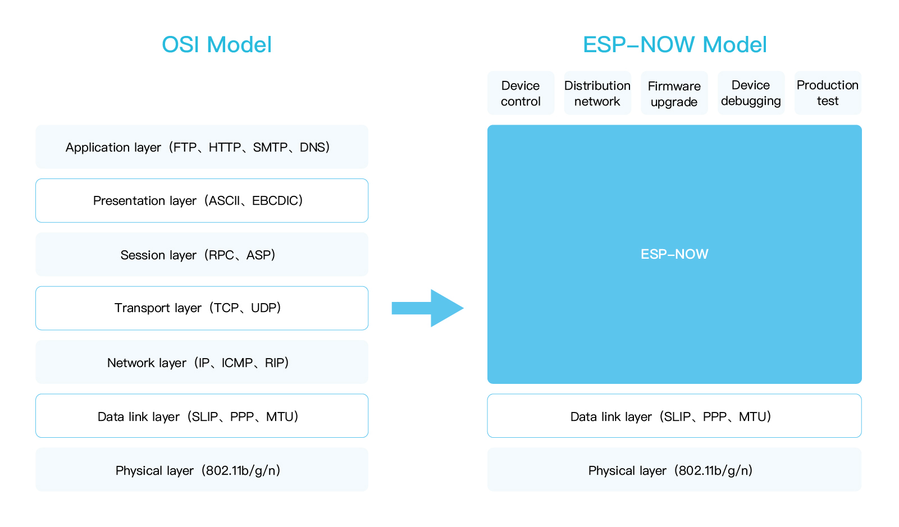
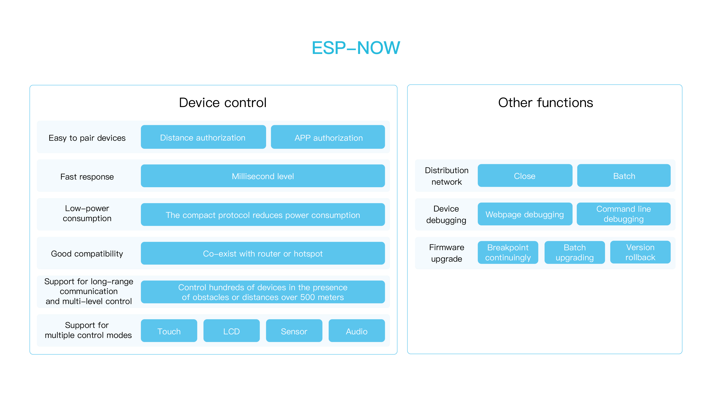
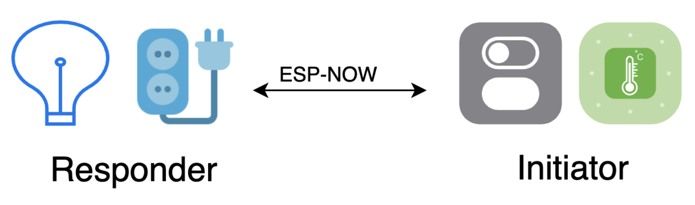

# ESP-NOW
This project provides examples to simplify the use of ESP-NOW.  

[ESP-NOW](https://docs.espressif.com/projects/esp-idf/en/latest/esp32/api-reference/network/esp_now.html) is a kind of connectionless Wi-Fi communication protocol that is defined by Espressif. Different from traditional Wi-Fi protocols, the first five upper layers in OSI are simplified to one layer in ESP-NOW, so the data doesn't need to be transmitted through the network layer, the transport layer, the session layer, the presentation layer, and the application layer, which reduces the delay caused by packet loss under congested network, and leads to quickly response time.



## Introduction

The [ESP-NOW](https://docs.espressif.com/projects/esp-idf/en/latest/esp32/api-reference/network/esp_now.html) provided by [ESP-IDF](https://github.com/espressif/esp-idf) is the ESP-NOW protocol, this component provides some high-level functionalities to simplify the use of ESP-NOW protocol, you can understand this component as an application-level ESP-NOW, which provides some enhanced features, including pairing, control, provisioning, debug, OTA, security, etc.

ESP-NOW occupies less CPU and flash resource. It can work with Wi-Fi and Bluetooth LE, and supports the series of ESP8266、ESP32、ESP32-S and ESP32-C. The data transmission mode of ESP-NOW is flexible including unicast and broadcast, and supports one-to-many and many-to-many device connection and control.



There are two roles defined in ESP-NOW according to the data flow, initiator and responder. The same device can have two roles at the same time. Generally, switches, sensors, LCD screens, etc. play the role of initiator in an IoT system, when lights, sockets and other smart applications play the role of responder.



## TODO List
  - [ ] Gateway
  - [ ] Low-power
  - [ ] Frequency-Hopping

### IDF Version

The following table shows the ESP-IDF versions supported by esp-now at the current time. The lable  means supported, and the lable  means not supported.

The ESP-IDF master branch is marked as not supported because the major feature changes it has introduced may cause conflicts with esp-now. Yet, the esp-now examples not affected by those feature changes can still run correctly on the IDF master branch.

End of Life IDF branches are marked as not supported, such as ESP-IDF Release/v4.0. See [IDF Supported Periods](https://docs.espressif.com/projects/esp-idf/en/latest/esp32/versions.html#support-periods) for details.


|                       | ESP-IDF <br> Release/v4.1| ESP-IDF <br> Release/v4.2| ESP-IDF <br> Release/v4.3| ESP-IDF <br> Release/v4.4 | ESP-IDF <br> Release/v5.0 | ESP-IDF <br> Release/v5.1 | ESP-IDF <br> Release/v5.2 | ESP-IDF <br> Master |
|:----------- | :---------------------:|:---------------------: | :---------------------:| :---------------------:| :---------------------:| :---------------------:| :---------------------:| :---------------------:|
| esp-now <br> Master  |  |  |  |  |  |  |  | |
| esp-now <br> v2.x.x  |  |  |   |  <sup> **2** </sup> |  |   |  | |
| esp-now <br> v1.0  |  |  |  |  <sup> **1** </sup> |  |  |  | |


**Note 1:** The built-in IDF branch of esp-now v1.0 is IDF Release/v4.4 at the current time.

**Note 2:** The built-in IDF branch of esp-now v2.x.x is from IDF Release/v4.4 at the current time.

### Support Periods

New feature development and bugfix usually take place on the master branch and will be published into [ESP Component Registry](https://components.espressif.com/). The publish time of the next version is usually a few months. When a new version of the ESP-NOW is published, please plan to upgrade to that version.

## Quick Start
### Hardware Preparation
Chips of ESP32、ESP32-C3、ESP32-S2、ESP32-S3、ESP32C2、ESP32-C6 are recommended.

### Set up Development Environment
Setting the environment and getting ESP-IDF (release/v4.4 or tag v4.4) follow the [Step](https://docs.espressif.com/projects/esp-idf/en/release-v4.4/esp32/index.html) .

### Get the ESP-NOW project
Download ESP-NOW using the following:
```shell
git clone https://github.com/espressif/esp-now.git
```

### Build and Flash firmware
It is recommended to first erase the flash if you are using this for the first time and then flash the firmware. Here are the steps:
```shell
$ cd /path/to/esp-now/examples/get-started/
$ export ESPPORT=/dev/tty.SLAB_USBtoUART
$ idf.py set-target esp32c3
$ idf.py erase_flash
$ idf.py flash monitor
```

## Function
### Control
There are some obvious advantages in ESP-NOW:

1. **Quick Response**: After power-on, the devices can transmit data and control other paired devices directly without any wireless connection, and the response speed is in milliseconds.
2. **Good Compatibility**: When the device connects to a router or works as a hotpot, it can also realize a fast and stable communication by ESP-NOW. And the device can keep stable connection through ESP-NOW even if the router is faulty or the network is unstable.
3. **Long-distance Communication**: ESP-NOW supports long-distance communication. It can be applied to outdoor scenes and can keep stable connection even the devices are separated by walls even floors.
4. **Multi-hop Control**: The multi-hop control of devices can be realized by ESP-NOW. Hundreds of devices can be controlled through unicast, broadcast and group control.

### Provision

ESP-NOW provides a new provisioning method besides the Wi-Fi provisioning and Bluetooth provisioning. First, configuring the network for the first device via bluetooth, and other devices don't need to be configured the information of SSID/password, because the first device connected to the network can send these information to others directly. Users can choose whether to allow remaining devices to access the network on the APP side.

### Upgrade
ESP-NOW can be used for the mass data transmission like firmware upgrade.

1. **Resume Upgrade from Break-point**: When use ESP-NOW to upgrade the firmware, the firmware will be subpackaged in a fixed size and be written to the flash one by one, and the device will record upgraded packages. If the upgrade process is interrupted, the device will only request the remaining firmware packages to resume upgrade from break point.
2. **Multiple Devices Upgrade**: ESP-NOW can support multiple devices upgrade at same time. 50 devices can be upgraded in 3 minutes.
3. **Rollback**: The firmware can rollback to previous version if an upgrade error occurs.

### Debug

ESP-NOW can be used to receive the running log for debugging. It can be used in scene where the devices can't be contact directly because of the high-voltage electricity, high temperature. With the supporting of many-to-many connections, the initiator can receive logs from multiple responders to diagnose device faults quickly.

1. Device Log
    - Log Analysis: analysis the running time and restart times from log.
    - Log Storage: store the acquired data in the SD cards or export to the web.
    - Log Level Modification: the log level of each function model can be freely adjusted.
2. Debug Commands
    - Peripheral Debugging: Control commands can be sent to test the peripherals like GPIO, UART, LED, etc.
    - Wi-Fi Debugging: The country code, Wi-Fi mode, Wi-Fi power, etc., can be adjusted, and the performance of Wi-Fi can be debugged.
    - Status Debugging: restart command, reset command, memory and task running status command.
    - Custom Commands
3. Production Test
    - Aging Test: random restart, long-term monitoring of device
    - Interference Test: distribute a large number of Wi-Fi data packets to interfere with the network.
    - Wireless Test: monitor the RF performance, ping packet test, distance and RF performance test.
    - Module Test: flash read time test, time accuracy test.
    - Version Verification: verify whether the factory version of the device is the specified version.

### Data Encryption

ESP-NOW can protect the data security with ECDH and AES128-CCM.

1. **Quick Configuration**: 16 devices can be configurated in 5 seconds.
2. **Multiple Devices Handshake**: ESP-NOW initiator can support multiple devices handshake at same time. 
3. **Safety**:
    - ECDH and Proof of Possession (PoP) string used to authorize session and derive shared key
    - AES256-CTR mode encryption for the configuration data
    - AES128-CCM mode encryption for ESP-NOW data.

## Resources
- [ESP-NOW API guide](https://docs.espressif.com/projects/esp-idf/en/latest/esp32c3/api-reference/network/esp_now.html)
- [ESP-NOW in Arduino](https://github.com/yoursunny/WifiEspNow)
- The [esp32.com forum](https://esp32.com/) is a place to ask questions and find community resources.
- [Check the Issues section on github](https://github.com/espressif/esp-now/issues) if you find a bug or have a feature request. Please check existing Issues before opening a new one.
- [Troubleshooting](https://docs.espressif.com/projects/espressif-esp-faq/en/latest/) which include some common FAQs. Please click it if something is not working when you enable ESP-NOW in your project.
