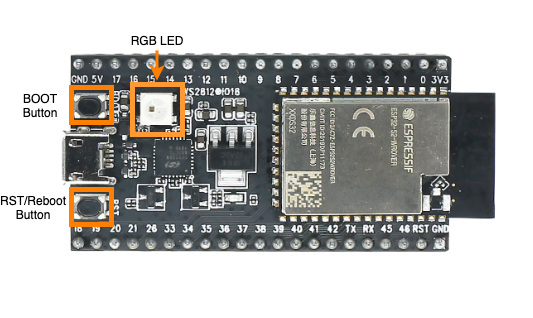

# Control Example

This example demonstrates the interaction process between the devices.

## Functionality

By using the `BOOT` button and `RGB LED` on the development boards, the initiator device sends the control commands and the responder devices change the LED status when receiving the control commands.

- Press the `BOOT` button to send control commands
- `RGB LED` will display the status after receiving the commands

## Hardware Required

This example can run on any ESP32 series boards and at least two development boards (for example: ESP32-S2-Saola-1 or ESP32-C3-DevKitM-1) are required. You need to use the `BOOT` button and `RGB LED` on the development boards to demonstrate.

> Note: If you are using other boards, please modify the GPIOs accordingly.



## How to Use the Example

### Binding

Double click the `BOOT` button on one device, this device will send the binding command. This device acts as the initiator. When other devices receive the binding command, the `RGB LED` on these devices will turn green, indicating that the devices have been successfully bound. Other devices act as the responders.

Output sample from the initiator:

```
I (60589) app_main: initiator bind press
```

Output sample from the responder:

```
I (40550) app_main: bind, uuid: 7c:df:a1:76:42:38, initiator_type: 513
```

### Control

Single click the `BOOT` button on the initiator device, this device will send the control command. When other devices receive the control command, the status of `RGB LED` (ON/OFF) will be controlled by the initiator device, and the color will be white.

> Note: The device can only control the bound devices, so it must be bound before control.

Output sample from the initiator:

```
I (111469) app_main: initiator send press
I (113279) app_main: initiator send press
I (116679) app_main: initiator send press
```

Output sample from the responder:

```
I (91430) app_main: espnow_ctrl_responder_recv, initiator_attribute: 513, responder_attribute: 1, value: 1
I (93240) app_main: espnow_ctrl_responder_recv, initiator_attribute: 513, responder_attribute: 1, value: 0
I (96640) app_main: espnow_ctrl_responder_recv, initiator_attribute: 513, responder_attribute: 1, value: 1
```

### Unbind

Long press (more than 1.5 seconds) the `BOOT` button on the initiator device, this device will send the unbinding command. When other devices receive the unbinding command, the `RGB LED` on these devices will turn red, indicating that the devices have been unbound successfully.

Output sample from the initiator:

```
I (158709) app_main: initiator unbind press
```

Output sample from the responder:

```
I (138670) app_main: unbind, uuid: 7c:df:a1:76:42:38, initiator_type: 513
```

## Note

The roles of `initiator` and `responder` will be on the devices at the same time. When the user presses the `BOOT` button on one device, this device will act as the initiator to send commands to other devices. When other devices receive the commands, they will change the status of `RGB LED` to show that the command is handled.
