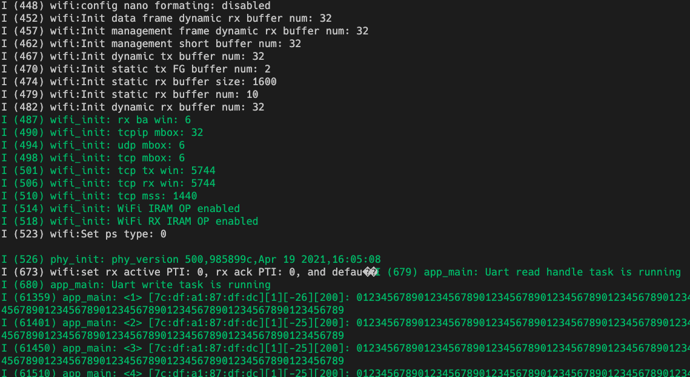
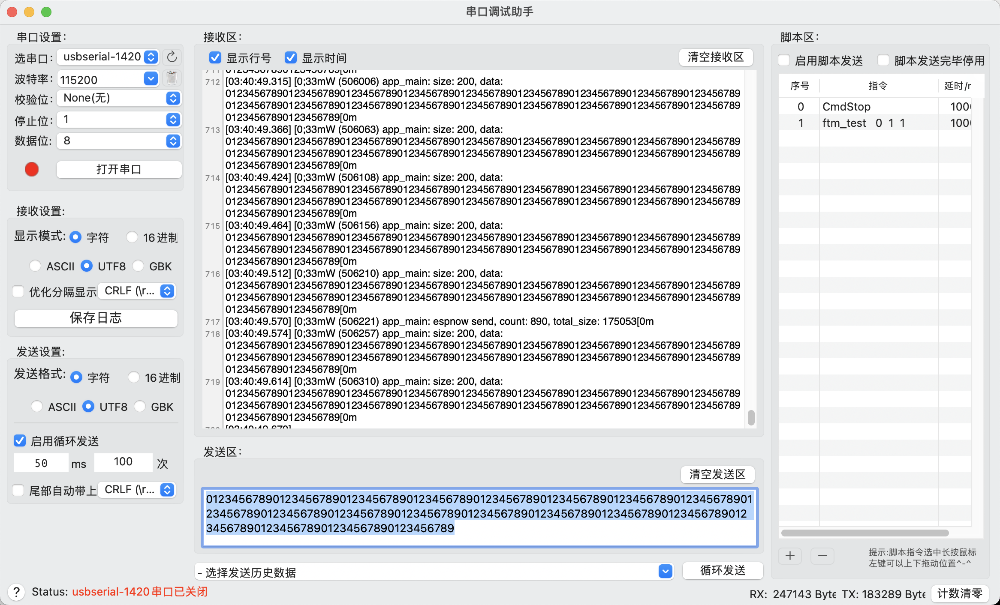

# Get Started Example

This example demonstrates how to use the ESP-NOW data to communicate.

## Functionality

One device receives data through the serial port and broadcasts it to all nodes through ESP-NOW data. The others will output the data through the serial port when receive the data.

## Hardware Required

This example can run on any ESP32 series boards and at least two development boards are required.

## Configuration

Open the project configuration menu (`idf.py menuconfig`) to configure the packet retransmission counts and the UART port for data communication using (Refer to Kconfig file).

## Example Output

- Output sample from the receiving device:

 Packet receiving device log 

- Output sample from the sending device:

 The log of the sending device 

