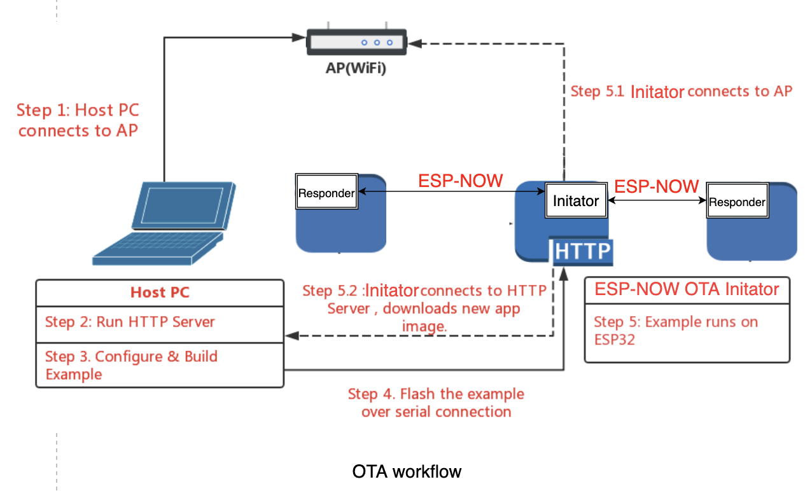

# OTA Example

This example demonstrates how to use ESP-NOW OTA feature to help upgrading other devices.

## Hardware Required

This example can run on any ESP32 series boards and at least two development boards are required, 1 works as initiator, and the others work as responders.

## Configuration

Open the project configuration menu (`idf.py menuconfig`) to configure the OTA mode and firmware upgrade URL (Refer to Kconfig file).

## How to Use the Example



### Step 1: Connect to the router

Connect PC to the router, the `ESP-NOW OTA Initiator Device` will connect to this router later.

### Step 2: Run HTTP server

A built-in python HTTP server can be used as the server for the example upgrade.
Open a new terminal to run the HTTP server, and then run the below command to generate the firmware to be upgraded and start the server.
```shell
cd $IDF_PATH/examples/get-started/hello_world/
idf.py build
cd build
python -m http.server 8070
```

While the server is running, you may open this `http://localhost:8070/` in browse to check the build directory.

> Note:
	1. If there are firewall softwares that prevent any access to the port 8070, please grant the access while the example is running.

### Step 3: Build & Flash & Run the responders

Navigate to the OTA example directory, and type `idf.py menuconfig` to configure the OTA example.

Set following configurations under `Example Connection Configuration` Options:
* Set `WiFi SSID` of the Router (Access-Point).
* Set `WiFi Password` of the Router (Access-Point).

Set following configurations under `Example Configuration` Options:
* Set `ESP-NOW mode` to `Responder Mode`

When downloading the flash, it's recommend to use `erase_flash` to erase the entire flash memory (all the remaining data in ota_data partition will be deleted as well) for the first time, and then write the followings via a serial port:

```shell
idf.py erase_flash flash
```

When the example on the responder device starts up, it will:

1. Connect to the AP with configured SSID and password.
2. Create OTA task to receive OTA frames.
3. Response with OTA information if receives OTA request frame.
4. Write the image to flash if receives OTA image data. If receives all the image, configure the next boot from this image.
5. If reboot the device, it will run to the new image.

### Step 4: Build & Flash & Run the initiator

Navigate to the OTA example directory, and type `idf.py menuconfig` to configure the OTA example.

Set following configurations under `Example Connection Configuration` Options:
* Set `WiFi SSID` of the Router (Access-Point).
* Set `WiFi Password` of the Router (Access-Point).

Set following configurations under `Example Configuration` Options:
* Set `ESP-NOW mode` to `Initiator Mode`
* Set firmware upgrade URL
  
```
http://<host-ip-address>:<host-port>/<firmware-image-filename>

for e.g,
http://192.168.0.3:8070/hello-world.bin
```

When downloading the flash, it's recommend to use `erase_flash` to erase the entire flash memory (all the remaining data in ota_data partition will be deleted as well) for the first time, and then write the followings via a serial port:

```shell
idf.py erase_flash flash
```

When the example on the initiator device starts up, it will:

1. Connect to the AP with configured SSID and password.
2. Connect to the HTTP server and download the new image.
3. Scan OTA responders and get responder list.
4. Send the new image in ESP-NOW data to responders until all responders have finished upgrading or sending times reach CONFIG_ESPNOW_OTA_RETRY_COUNT.

## Example Output
Note that the output, in particular the order of the output, may vary depending on the environment.

Console output of the initiator:
```
I (4460) example_connect: Connected to example_connect: sta
I (4466) example_connect: - IPv4 address: 192.168.1.100
I (4472) example_connect: - IPv6 address: fe80:0000:0000:0000:7edf:a1ff:fe76:4238, type: ESP_IP6_ADDR_IS_LINK_LOCAL
I (4484) wifi:Set ps type: 0

I (4487) ESPNOW: espnow [version: 1.0] init
I (4491) app_main: Open HTTP connection: http://192.168.1.106:8070/hello-world.bin
I (6164) app_main: The service download firmware is complete, Spend time: 1s
I (6165) esp_image: segment 0: paddr=001f0020 vaddr=3c020020 size=05f48h ( 24392) map
I (6172) esp_image: segment 1: paddr=001f5f70 vaddr=3fc89c00 size=01a84h (  6788) 
I (6179) esp_image: segment 2: paddr=001f79fc vaddr=40380000 size=0861ch ( 34332) 
I (6189) esp_image: segment 3: paddr=00200020 vaddr=42000020 size=1516ch ( 86380) map
I (6203) esp_image: segment 4: paddr=00215194 vaddr=4038861c size=014b0h (  5296) 
I (6204) esp_image: segment 5: paddr=0021664c vaddr=50000000 size=00010h (    16) 
W (8321) app_main: espnow wait ota num: 1
I (8321) espnow_ota_initatior: [espnow_ota_initiator_send, 301]: total_size: 157312, packet_num: 697
I (9180) espnow_ota_initatior: count: 0, Upgrade_initiator_send, requested_num: 1, unfinished_num: 1, successed_num: 0
I (11260) espnow_ota_initatior: count: 1, Upgrade_initiator_send, requested_num: 1, unfinished_num: 1, successed_num: 0
I (11412) app_main: Firmware is sent to the device to complete, Spend time: 5s
I (11412) app_main: Devices upgrade completed, successed_num: 1, unfinished_num: 0

```
Console output of the responder:
```
I (4473) example_connect: Connected to example_connect: sta
I (4479) example_connect: - IPv4 address: 192.168.1.102
I (4485) example_connect: - IPv6 address: fe80:0000:0000:0000:7edf:a1ff:fe86:d824, type: ESP_IP6_ADDR_IS_LINK_LOCAL
I (4496) wifi:Set ps type: 0

I (4499) ESPNOW: espnow [version: 1.0] init
I (425039) espnow_ota_responder: The device starts to upgrade
I (427993) espnow_ota_responder: Write total_size: 157312, written_size: 157312, spend time: 2s
I (427994) espnow_ota_responder: Running firmware version: v1.0-beta1-10-gbb5d5ec-dirty
I (428000) espnow_ota_responder: Running firmware version: v4.3.1-dirty
I (428007) esp_image: segment 0: paddr=001f0020 vaddr=3c020020 size=05f48h ( 24392) map
I (428018) esp_image: segment 1: paddr=001f5f70 vaddr=3fc89c00 size=01a84h (  6788) 
I (428025) esp_image: segment 2: paddr=001f79fc vaddr=40380000 size=0861ch ( 34332) 
I (428036) esp_image: segment 3: paddr=00200020 vaddr=42000020 size=1516ch ( 86380) map
I (428050) esp_image: segment 4: paddr=00215194 vaddr=4038861c size=014b0h (  5296) 
I (428051) esp_image: segment 5: paddr=0021664c vaddr=50000000 size=00010h (    16) 
```
When responder device reboots, it will output: 
```
Hello world!
This is esp32c3 chip with 1 CPU core(s), WiFi/BLE, silicon revision 3, 4MB external flash
Minimum free heap size: 328644 bytes
Restarting in 10 seconds...
Restarting in 9 seconds...
Restarting in 8 seconds...
```
## Troubleshooting

* Check your PC can ping the ESP32 at its IP, and that the IP, AP and other configuration settings are correct in menuconfig.
* Check if any firewall software is preventing incoming connections on the PC.
* Check whether you can get firmware (default hello-world.bin), by checking the output of following command:

 ```
 curl -v http：// <host-ip-address>：<host-port> / <firmware-image-filename>
 ```

* If you have another PC or a phone, try viewing the file listing from the separate host.

### errors “ota_begin error err = 0x104”

If you see this error then check that the configured (and actual) flash size is large enough for the partitions in the partition table. The default "two OTA slots" partition table only works with 4 MB flash size. To use OTA with smaller flash sizes, create a custom partition table CSV (look in components/partition_table) and configure it in menuconfig.
