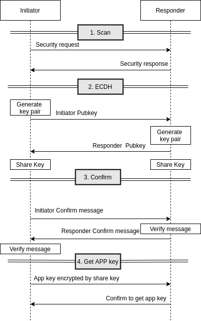

# Security Example

This example demonstrates how to configurate `ESP-NOW` encryption key to devices.

## Functionality
The process flow is as follows:



- Process uses [Protocomm](https://docs.espressif.com/projects/esp-idf/zh_CN/latest/esp32/api-reference/provisioning/protocomm.html?highlight=protocomm#protocol-communication) to provide simple callbacks to the application for setting the configuration.

- ECDH and confirm details refer to [security-schemes](https://docs.espressif.com/projects/esp-idf/zh_CN/latest/esp32/api-reference/provisioning/provisioning.html#security-schemes)

## Hardware Required

This example can be executed on any platform board and at least two development boards are required.

## Configuration

Open the project configuration menu (`idf.py menuconfig`) to configure the Proof of Possession (PoP) string. It is used to authorize session and derive shared key. Set the same in initiator and responder:

```
idf.py menuconfig
    Example Configuration  --->
        Proof of Possession  --->
            "espnow_pop"
```

## How to Use the Example

### Step 1: Build & Flash & Run the Responders
- Select the ESP-NOW security responder Mode:
```
idf.py menuconfig
    Example Configuration  --->
        ESP-NOW Mode  --->
            () ESP-NOW SEC initator Mode
            (X) ESP-NOW SEC responder Mode
```
- When the responder starts up, it will wait to receive security info.

### Step 2: Build & Flash & Run the Initiator
- Select the ESP-NOW security initator Mode:
```
idf.py menuconfig
    Example Configuration  --->
        ESP-NOW Mode  --->
            (X) ESP-NOW SEC initator Mode
            () ESP-NOW SEC responder Mode
```
- When the initiator starts up, it will
    * Scan the responders and get responder address list
    * Secure handshake (ECDH) with responders and confirm share key
    * Send app key encrypted by share key to responders

### Step 3: Send and Receive in secure mode

- When security state is over, encryption key derived from app key will be set. 
- Then data is encrypted and decrypted in AES128-CCM.
- In the example, message will be received from the serial port and broadcast to others in encrypted mode.
- Other node receives the espnow message and decrypt the data.

## Example Output

Output sample from the responder:
```
I (550) wifi:Set ps type: 0

I (553) phy_init: phy_version 4670,719f9f6,Feb 18 2021,17:07:07
I (642) wifi:mode : I (645) app_main: Uart read handle task is running
I (645) app_main: Uart write task is running
I (26512) espnow_sec_resp: Get APP key

I (716965) app_main: espnow_sec_send, count: 43, size: 23, data: Message from responder.
I (751668) app_main: espnow_sec_recv, <83> [24:0a:c4:d6:d3:00][1][-16][25]: Message from initiator
```

Output sample from the initiator:
```
I (564) wifi:Set ps type: 0

I (567) phy_init: phy_version 4670,719f9f6,Feb 18 2021,17:07:07
I (657) wifi:modeI (660) app_main: Uart read handle task is running
I (660) app_main: Uart write task is running
W (767) app_main: espnow wait security num: 1
I (767) espnow_sec_init: count: 0, Secure_initator_send, requested_num: 1, unfinished_num: 1, successed_num: 0
I (1807) app_main: App key is sent to the device to complete, Spend time: 1147ms, Scan time: 107ms
I (1807) app_main: Devices security completed, successed_num: 1, unfinished_num: 0

I (692257) app_main: espnow_sec_recv, <43> [24:0a:c4:04:5d:3c][1][-19][23]: Message from responder.
I (726959) app_main: espnow_sec_send, count: 83, size: 25, data: Message from initiator.
```