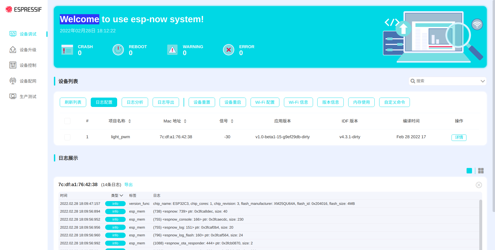

# ESP-NOW Debug Demo

This example demonstrates how to debug the ESP-NOW devices.

## Functionality

ESP-NOW debug receiver board or monitored device provides the following features through UART or espnow command:

- [Wi-Fi configuration](#Wi-Fi-Command): provides WiFi configuration, WiFi scan, WiFi ping commands.
- [ESP-NOW configuration](#ESP-NOW-Command): provides control, provisioning, OTA, configuration and iperf commands.
- [System command]: provides heap, version, restart, power save, reset, rollback, coredump commands.
- [Peripherals command]: provides GPIO, UART commands.
- [Command](#Command-Command): runs commands on specific devices.
- [General command](#Other-Command): includes help command to print all currently supported commands.

ESP-NOW debug receiver board also provides the following features:

- Receives running log from ESP-NOW devices via [ESP-NOW](https://esp-idf.readthedocs.io/en/latest/api-reference/wifi/esp_now.html) wireless transmission technology.
- [Web server](#Web-Server): starts a HTTP web server, and PC web browser can get running log and status from the server.

ESP-NOW monitored device also provides the following features:

- The device log data will be stored in flash and sent through ESP-NOW data.
- The monitored device also implements the function of transferring log data to the TCP server on the HTTP network.

> Note:
>
> 1. ESP-NOW debug receiver board can receive debugging data from devices only when the board is on the same Wi-Fi channel with the devices.
> 2. If the ESP-NOW debug receiver board is on the same channel with devices, you don't need to connect the board with the router.

## Hardware Required

This example can run on any ESP32 series boards and at least two development boards are required. One is the debug receiver board and others are monitored devices.

## Configuration

Open the project configuration menu (`idf.py menuconfig`) to configure "ESP-NOW debug monitor Mode" on debug receiver board or "ESP-NOW debug monitored Mode" on monitored devices.

For debug monitor mode, configure web server to debug devices through the web pages (Refer to Kconfig file).

For debug monitored mode, post monitored device log to HTTP server (Refer to Kconfig file).

## How to Use the Example

### Workflow

1. Compile and flash this project to an ESP32 development board;
2. Open serial port terminal and restart development board:

> Please use serial port terminals such as `minicom` to avoid some unexpected problems when using `idf.py monitor`.

3. Debug ESP-NOW by entering the following commands according to the prompts.

> The following describes the use of each command in sequence.

### Serial Port Commands

* ESP-NOW debug receiver board or monitored device supports the following serial port commands: help, wifi_config, wifi_scan, wifi_ping and command, provisioning, control, ota.
* The interaction of serial port commands follows the following rules:

  1. PC sends commands to ESP-NOW debug receiver board through serial port with a baud rate of 115200.
  2. In command definition, all characters are lowercase (some options are uppercase), and strings do not need to be quoted.
  3. The elements in angle brackets <> in command description should be taken as a parameter and be replaced as the case may be.
  4. The part contained in square brackets [] or brackets () in command description is the value range that can be filled in.
  5. The pattern of serial port commands is shown below, with each element separated by a space:

     ```
     Command ＋ Option ＋ Parameter，for example: wifi_config -c 1
     ```
  6. Serial port commands support line breaks: `\n` and `\r\n`.
  7. Serial port returns execution results at a baud rate of 115200.

### Wi-Fi Command

1. Wi-Fi configuration
   |                    |                                                                                                                   | Note                                                                              |
   | ------------------ | ----------------------------------------------------------------------------------------------------------------- | --------------------------------------------------------------------------------- |
   | Command definition | `wifi_config -i -c <channel (1 ~ 13)> -s <ssid> -b <bssid (xx:xx:xx:xx:xx:xx)> -p <password> -C <country_code>` |                                                                                   |
   | Command            | wifi_config -i                                                                                                    | Get Wi-Fi information                                                             |
   |                    | wifi_config -c -s -b -p -C                                                                                        | Set Wi-Fi configuration                                                           |
   | Parameter          | `-i` or `--info`                                                                                              | Wi-Fi information                                                                 |
   |                    | `-c` or `--channel`                                                                                           | Wi-Fi work channel                                                                |
   |                    | `-s` or `--ssid`                                                                                              | AP SSID                                                                           |
   |                    | `-b` or `--bssid`                                                                                             | AP BSSID                                                                          |
   |                    | `-p` or `--password`                                                                                          | AP password                                                                       |
   |                    | `-C` or `--country_code`                                                                                      | Set the current country code                                                      |
   | Example            | wifi_config -s ` "ssid"` -p ` "password"`                                                                     | Wi-Fi sets and connects to the AP with SSID as "ssid" and password as "password". |
   |                    | wifi_config -c 11                                                                                                 | Configure the working channel of the ESP-NOW device to be 11                      |
2. Scan command
   |                    |                                                                                            | Note                                                                                     |
   | ------------------ | ------------------------------------------------------------------------------------------ | ---------------------------------------------------------------------------------------- |
   | Command definition | `wifi_scan -r <rssi (-120 ~ 0)> -s <ssid> -b <bssid (xx:xx:xx:xx:xx:xx)> -p <time (ms)>` |                                                                                          |
   | Command            | wifi_scan -r -s -b -p                                                                      | Scan APs                                                                                 |
   | Parameter          | `-r` or `--rssi`                                                                       | Filter devices by RSSI                                                                   |
   |                    | `-s` or `--ssid`                                                                       | Filter devices by SSID                                                                   |
   |                    | `-b` or `--bssid`                                                                      | Filter devices by BSSID                                                                  |
   |                    | `-p` or `--passive`                                                                    | Passive scan time of each channel                                                        |
   | Example            | wifi_scan                                                                                  | Scan all APs                                                                             |
   |                    | wifi_scan -r -60                                                                           | Scan devices with RSSI signal value within -60                                           |
   |                    | wifi_scan -p 600 -b 30:ae:a4:80:16:3c                                                      | Scan devices with BSSID 30:ae:a4:80:16:3c and set passive scan time 600 ms every channel |
3. Ping command
   |                    |                                                    | Note                                              |
   | ------------------ | -------------------------------------------------- | ------------------------------------------------- |
   | Command definition | `ping <host> -W <t> -i <t> -s <n> -c <n> -Q <n>` |                                                   |
   | Command            | `ping host -w -i -s -c -Q`                       | Send ICMP ECHO_REQUEST to network hosts           |
   | Parameter          | `host`                                           | Host address                                      |
   |                    | `-w` or `--timeout`                            | Time to wait for a response, in seconds           |
   |                    | `-i` or `--interval`                           | Wait interval seconds between sending each packet |
   |                    | `-s` or `--size`                               | Specify the number of data bytes to be sent       |
   |                    | `-c` or `--count`                              | Stop after sending count packets                  |
   |                    | `-Q` or `--tos`                                | Set Type of service related bits in IP datagrams  |
   | Example            | ping 192.168.0.1                                   | Ping host address 192.168.0.1                     |

### ESP-NOW Command

1. Scan
   |                    |                                                             | Note                                           |
   | ------------------ | ----------------------------------------------------------- | ---------------------------------------------- |
   | Command definition | `scan <addr (xx:xx:xx:xx:xx:xx)> -a -r <rssi (-120 ~ 0)>` |                                                |
   | Command            | `scan <addr> -a -r`                                       | Find devices that support ESP-NOW debug        |
   | Parameter          | `<addr>`                                                  | MAC of the monitored device                    |
   |                    | `-a` or `--all`                                         | Full channel scan                              |
   |                    | `-r` or `--rssi`                                        | Filter devices by RSSI                         |
   | Example            | scan -a                                                     | Scan all devices in all channel                |
   |                    | scan -r -60                                                 | Scan devices with RSSI signal value within -60 |
   |                    | scan 30:ae:a4:80:16:3c                                      | Scan devices with BSSID 30:ae:a4:80:16:3c      |
2. Provisioning
   |                    |                                                                   | Note                                                                               |
   | ------------------ | ----------------------------------------------------------------- | ---------------------------------------------------------------------------------- |
   | Command definition | `provisioning -er -i <beacon_time(s)> <ap_ssid> <app_password>` |                                                                                    |
   | Command            | provisioning -e -r -i                                             | Provisioning                                                                       |
   | Parameter          | `-e` or `--erase`                                             | Reset WiFi provisioning information and restart                                    |
   |                    | `-r` or `--responder`                                         | Responder devices start provisioning                                               |
   |                    | `-i` or `--initiator`                                         | Set provisioning beacon time                                                       |
   |                    | `ap_ssid` `ap_password`                                       | Configure network for devices                                                      |
   | Example            | provisioning -e                                                   | Reset WiFi provisioning information and restart                                    |
   |                    | provisioning -r                                                   | Responder devices start provisioning                                               |
   |                    | provisioning -i 30000 myssid mypassword                           | Send provisioning beacon for 30 s and send WiFi configuration to responder devices |
3. Control
   |                    |                                                                                                                                                                                                           | Note                                                                                              |
   | ------------------ | --------------------------------------------------------------------------------------------------------------------------------------------------------------------------------------------------------- | ------------------------------------------------------------------------------------------------- |
   | Command definition | `control  -lasC -b <initiator_attribute> -u <initiator_attribute> -c <initiator_attribute> -m <addr (xx:xx:xx:xx:xx:xx)> -t <responder_attribute> -v <responder_value> -b <count> -t <count> -r <rssi>` |                                                                                                   |
   | Command            | control -lasC -b -u -c -m -t -v -b -t -r                                                                                                                                                                  | Control devices by esp-now command                                                                |
   | Parameter          | `-l` or `--list`                                                                                                                                                                                      | Get device binding list                                                                           |
   |                    | `-a` or `--ack`                                                                                                                                                                                       | Wait for the receiving device to return ack                                                       |
   |                    | `-s` or `--filter_weak_signal`                                                                                                                                                                        | Discard packets which rssi is lower than forward_rssi                                             |
   |                    | `-C` or `--filter_adjacent_channel`                                                                                                                                                                   | Discard packets from adjacent channels                                                            |
   |                    | `-b` or `--bind`                                                                                                                                                                                      | Binding with response device                                                                      |
   |                    | `-u` or `--unbind`                                                                                                                                                                                    | Unbinding with response device                                                                    |
   |                    | `-c` or `--command`                                                                                                                                                                                   | Control command to bound device                                                                   |
   |                    | `-m` or `--mac`                                                                                                                                                                                       | MAC of the monitored device                                                                       |
   |                    | `-t` or `--responder_attribute`                                                                                                                                                                       | Responder's attribute                                                                             |
   |                    | `-v` or `--responder_value`                                                                                                                                                                           | Responder's value                                                                                 |
   |                    | `-b` or `--broadcast`                                                                                                                                                                                 | Broadcast packet                                                                                  |
   |                    | `-t` or `--forward_ttl`                                                                                                                                                                               | Number of hops in data transfer                                                                   |
   |                    | `-r` or `--forward_rssi`                                                                                                                                                                              | Discard packet which rssi is lower than forward_rssi                                              |
   | Example            | control -b 0x200                                                                                                                                                                                          | Bind device, initiator_attribute: 512                                                             |
   |                    | control -u 0x200                                                                                                                                                                                          | Unbind device, initiator_attribute: 512                                                           |
   |                    | control -c 0x200 -t 0x1 -v 0                                                                                                                                                                              | Send control command,initiator_attribute: 512, set responder_attribute: 1, responder_value: 0     |
   |                    | control -c 0x200 -t 0x101 -v 100                                                                                                                                                                          | Send control command,initiator_attribute: 512, set responder_attribute: 257, responder_value: 100 |
4. OTA
   |                    |                                                                            | Note                                         |
   | ------------------ | -------------------------------------------------------------------------- | -------------------------------------------- |
   | Command definition | `ota -d <url> -f <wait_tick> -s <xx:xx:xx:xx:xx:xx>,<xx:xx:xx:xx:xx:xx>` |                                              |
   | Command            | ota -d -f -s                                                               | Firmware update                              |
   | Parameter          | `-d` or `--download`                                                   | Firmware Download url                        |
   |                    | `-f` or `--find`                                                       | Find upgradeable devices                     |
   |                    | `-s` or `--send`                                                       | Send firmware to selected device             |
   | Example            | ota -d http://192.168.0.3:8070/hello-world.bin                             | Download Firmware                            |
   |                    | ota -f 3000                                                                | Find upgradeable devices for no more than 3s |
   |                    | ota -s 30:ae:a4:80:16:3c                                                   | Send firmware to 30:ae:a4:80:16:3c           |
5. Configuration
   |                    |                                                                                                                                                                   | Note                                            |
   | ------------------ | ----------------------------------------------------------------------------------------------------------------------------------------------------------------- | ----------------------------------------------- |
   | Command definition | `espnow_config -i -c <channel (1 ~ 13)> -r <rate (wifi_phy_rate_t)> -t <tx_power (8, 84)> -p <protocol_bitmap[1, 2, 4, 8]> -C <country_code ('CN', 'JP, 'US')>` |                                                 |
   | Command            | espnow_config -i -c -r -t -p -C                                                                                                                                   | ESP-NOW configuration                           |
   | Parameter          | `-i` or `--info`                                                                                                                                              | Print all configuration information             |
   |                    | `-c` or `--channel`                                                                                                                                           | Channel of ESP-NOW                              |
   |                    | `-r` or `--rate`                                                                                                                                              | Wi-Fi PHY rate encodings                        |
   |                    | `-t` or `--tx_power`                                                                                                                                          | Set maximum transmitting power after WiFi start |
   |                    | `-p` or `--protocol`                                                                                                                                          | Set protocol type of specified interface        |
   |                    | `-C` or `--country_code`                                                                                                                                      | Set the current country code                    |
   | Example            | espnow_config -i                                                                                                                                                  |                                                 |
   |                    | espnow_config -r 0x0B                                                                                                                                             | Config ESPNOW data rate 6 Mbps                  |
6. Iperf
   |                    |                                                                                                                           | Note                                                             |
   | ------------------ | ------------------------------------------------------------------------------------------------------------------------- | ---------------------------------------------------------------- |
   | Command definition | `espnow_iperf -spga -c <responder (xx:xx:xx:xx:xx:xx)> -i <interval (sec)> -l <len (Bytes)> -t <time (sec)> -b <count>` |                                                                  |
   | Command            | espnow_iperf -spga -c -i -l -t -b                                                                                         | ESP-NOW iperf                                                    |
   | Parameter          | `-s` or `--responder`                                                                                                 | Run in responder mode, receive from throughput or ping           |
   |                    | `-p` or `--ping`                                                                                                      | Run in ping mode, send to responder                              |
   |                    | `-g` or `--group`                                                                                                     | Send a package to a group                                        |
   |                    | `-a` or `--abort`                                                                                                     | Abort running espnow-iperf                                       |
   |                    | `-c` or `--initiator`                                                                                                 | Run in initiator mode, ping to`<responder>`                    |
   |                    | `-i` or `--interval`                                                                                                  | Seconds between periodic bandwidth reports (default 3 secs)      |
   |                    | `-l` or `--len`                                                                                                       | Length of buffer in bytes to read or write (Defaults: 230 Bytes) |
   |                    | `-t` or `--time`                                                                                                      | Time in seconds to transmit for (default 10 secs)                |
   |                    | `-b` or `--roadcast`                                                                                                  | Send package by broadcast                                        |
   | Example            | espnow_iperf -s                                                                                                           | Run in responder mode                                            |
   |                    | espnow_iperf -c 30:ae:a4:80:16:3c                                                                                         | Send iperf packages to responder mac                             |

### *Command* Command

1. Command
   |                    |                                                                               | Note                                                 |
   | ------------------ | ----------------------------------------------------------------------------- | ---------------------------------------------------- |
   | Command definition | `command  -a <addr_list (xx:xx:xx:xx:xx:xx,xx:xx:xx:xx:xx:xx)> <"Command">` |                                                      |
   | Command            | command addr_list "Command"                                                   | Let the console command run on the monitoring device |
   | Parameter          | `-a` or `--channel_all`                                                   | Send packets on all channels                         |
   |                    | `addr_list`                                                                 | Device MAC address                                   |
   |                    | `"Command"`                                                                 | The command to be executed on a specific device      |
   | Example            | command 30:ae:a4:80:16:3c "help"                                              | Run help command on device 30:ae:a4:80:16:3c         |

### Other Command

* `help`: prints all currently supported commands.

### Web Server

The function is disabled by default. If you want to use the function, please follow the steps.

- Open Web server under `Example Configuration` Options:
  * Set `Enable WebServer for ESP-NOW debug` to `y`, default is `n`.
  * Set `mDNS Host Name`, default is `espnow-webserver`
  * Set `WiFi SoftAP SSID`, default is `espnow-webserver`
  * Set `Website mount point in VFS`, default is `/www`
- Connect PC or phone to `Wi-Fi SoftAP`
- Open url `http://espnow-webserver` in web browser, and customer can debug devices through the web browser, like getting all devices log and status, controlling or upgrading the monitored devices.



### Post monitored device log to HTTP server

The function is disabled by default. If you want to use the function, please follow the steps.

1. Run HTTP server with follow command or start TCP server on PC or phone.

```shell
python -m http.server 8070
```

2. Configure the devices with `idf.py menuconfig` under `Example Configuration` Options:
   * Set `Post flash log to HTTP server` to `y`.
   * Set the server URL `Flash log URL endpoint`
3. Build & flash & Run the device, connect the device to the Router (Access-Point) by WiFi command or provision command.

After the device connected to the Router (Access-Point), it will post log to the HTTP server.

> Note:

1. ESP32 and phone should be connected to the same router, so that data information can be collected on the network assistant tool.

## Note

1. Impact on Performance. Since ESP-NOW uses a Wi-Fi interface to send and receive data packages, delay may occur in receiving commands or in data transmission if there is a large amount of data to be transmitted among ESP-NOW devices. By testing in a good network, we provide the following thresholds, and with such configuration parameters, the delay caused to devices is negligible.

   * Fifty ESP-NOW devices (The more the devices, the worse the network.)
   * Set logging level to `info` (The lower the level, the worse the network may be.)
2. It should also be noted that when using a new chip for burning, the chip needs to be erased and then burned.
3. The log_info area is added to the partition table in this example as a space to save logs. The chip needs to be erased before programming.
4. The head of the data is a timestamp. It is just an experiment and there is no real-time calibration. It can be modified according to the user's own needs.
5. Get the status of log mode `uart`, `flash`, `espnow` in the console command `log -i`. The `console` command can't be used to disable the log configuration, because the main program has been forced to be enabled. If the user do not want to use such a function, the main program can be disable.

   ```
   // espnow_log_init(&log_config);
   ```
